Take a look at some of the fieldwork we do and the species we study!

## Fieldwork

::: {.gallery}

{.lightbox}

{.lightbox}

{.lightbox}

{.lightbox}

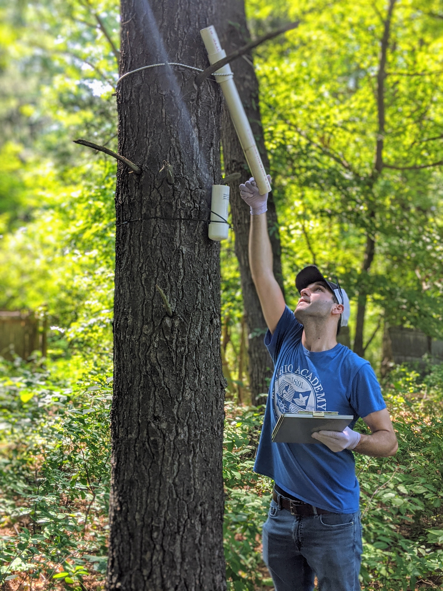{.lightbox}

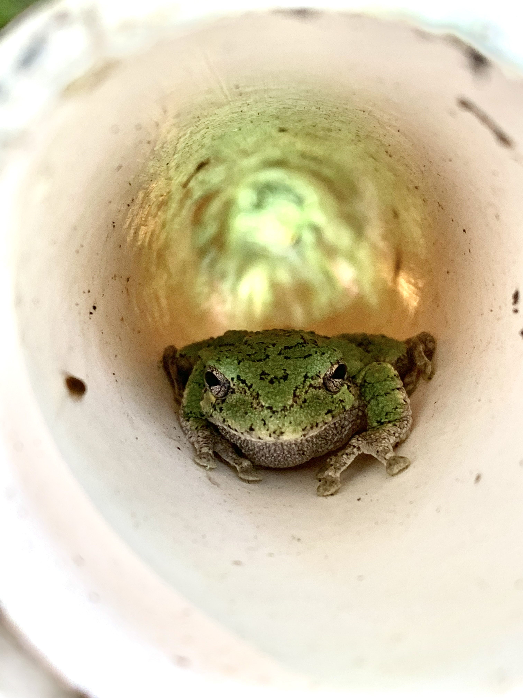{.lightbox}

{.lightbox}

{.lightbox}

:::

<video class="field-video"
       controls
       poster="images/field-notes/katharina-field-thumbnail.jpg">
  <source src="images/field-notes/katharina-field.mp4" type="video/mp4">
</video>

Collecting spadefoot toad tadpoles for an experiment.

<video class="field-video"
       controls
       poster="images/field-notes/toad-calling-thumbnail.jpg">
  <source src="images/field-notes/toad-calling.mp4" type="video/mp4">
</video>

Male American toad (*Anaxyrus americanus*) calling during the breeding season.

## Species We Study

::: {.gallery}

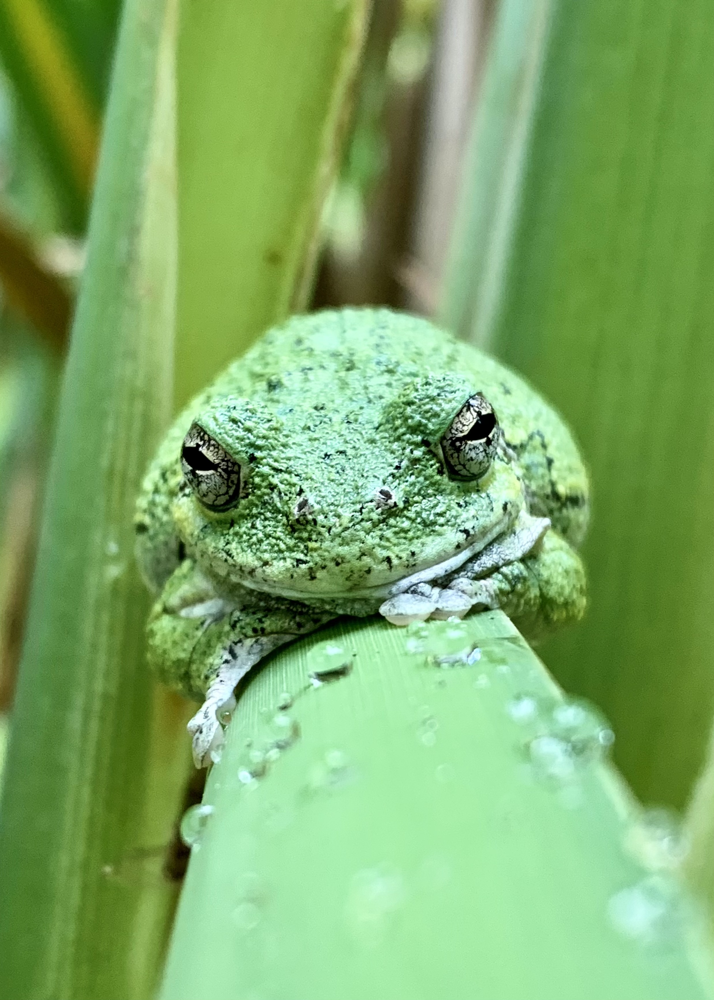{.lightbox}

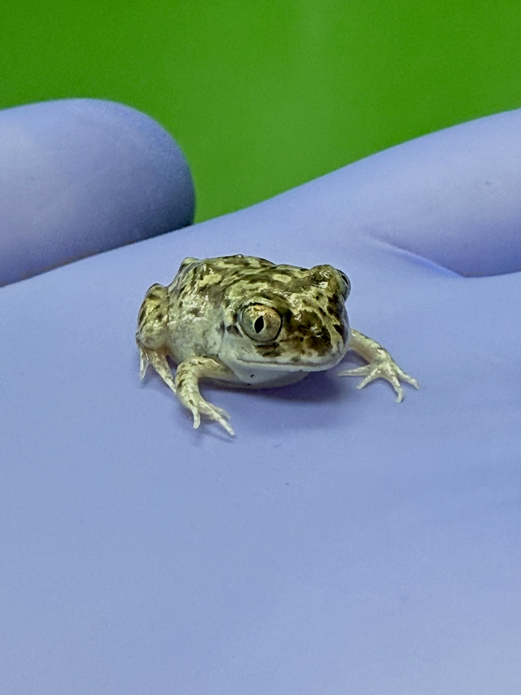{.lightbox}

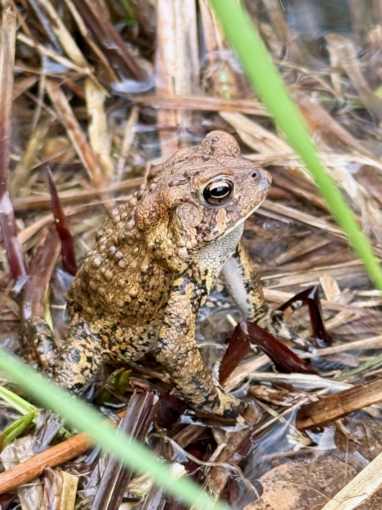{.lightbox}

{.lightbox}

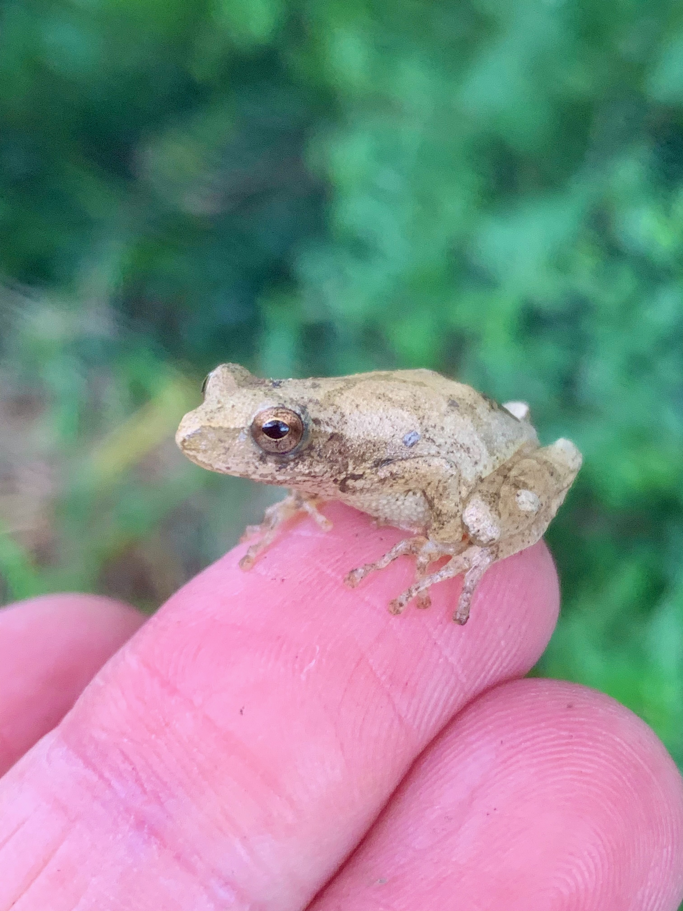{.lightbox}

{.lightbox}

:::

## Fun in the Lab!

::: {.gallery}

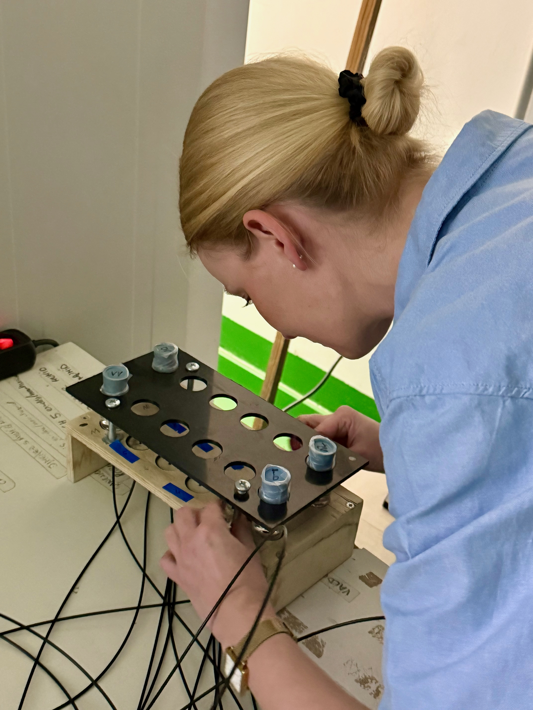{.lightbox}

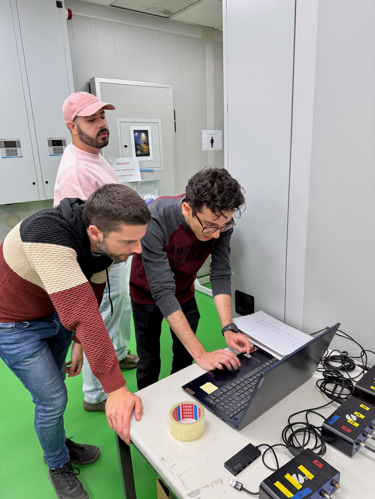{.lightbox}

{.lightbox}

{.lightbox}

:::

<video class="field-video"
       controls
       poster="images/field-notes/tadpole-eating-thumbnail.jpg">
  <source src="images/field-notes/tadpole-eating.mp4" type="video/mp4">
</video>

Spadefoot toad (*Pelobates cultripes*) tadpole eating spinach. Super cute!

---

## All the Herps!

::: {.gallery}

{.lightbox}

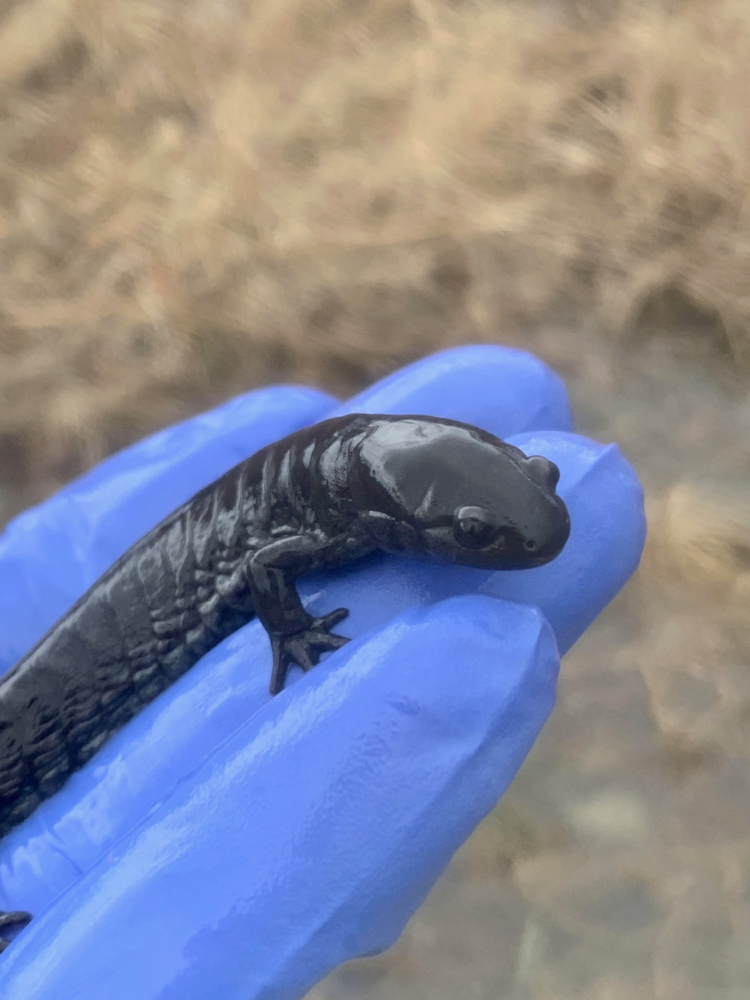{.lightbox}

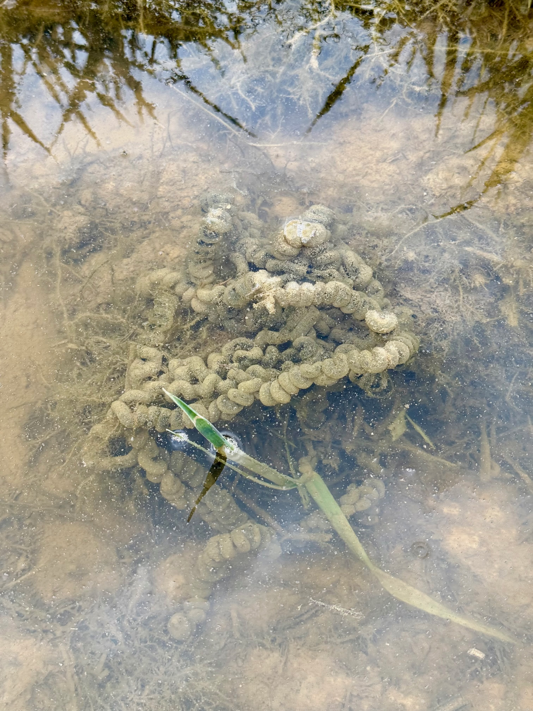{.lightbox}

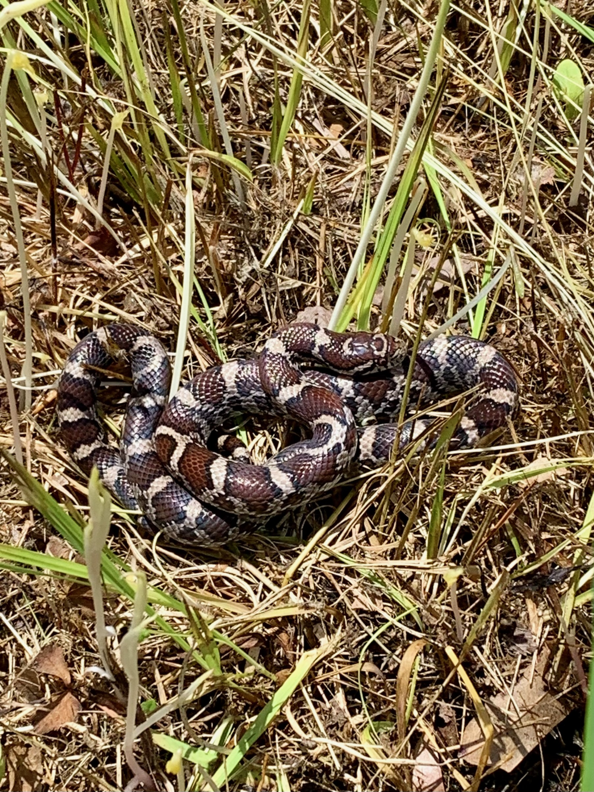{.lightbox}

{.lightbox}

:::

---

## Other Awesome Species

::: {.gallery}

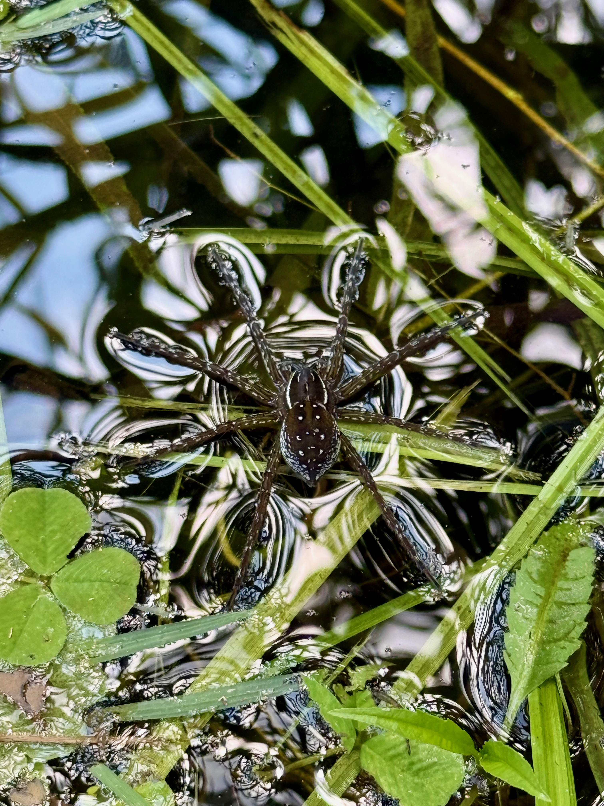{.lightbox}

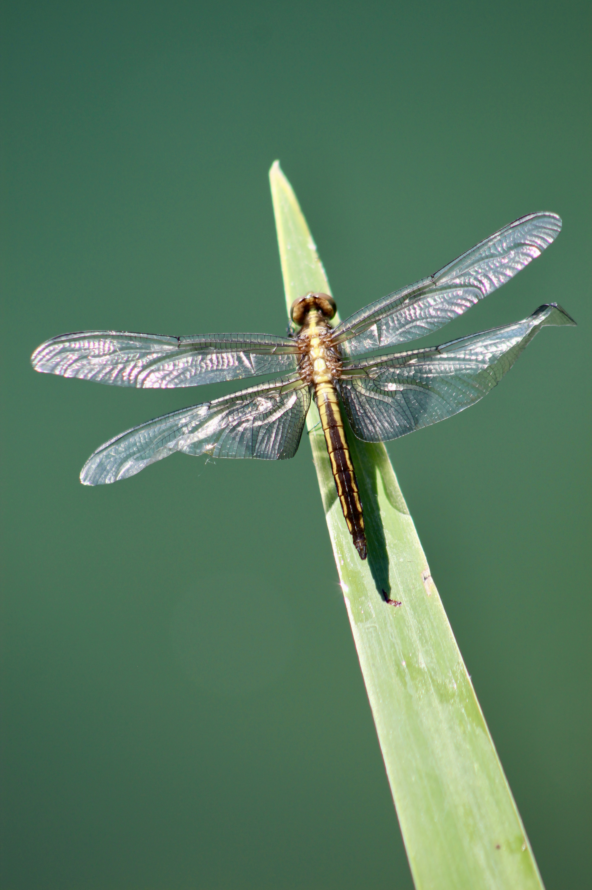{.lightbox}

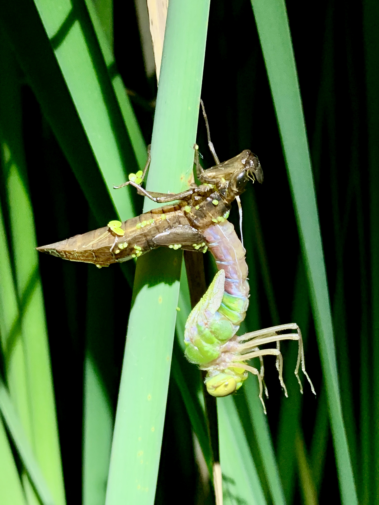{.lightbox}

:::
