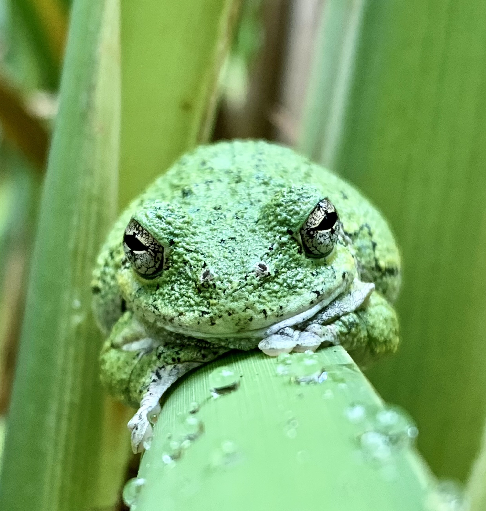
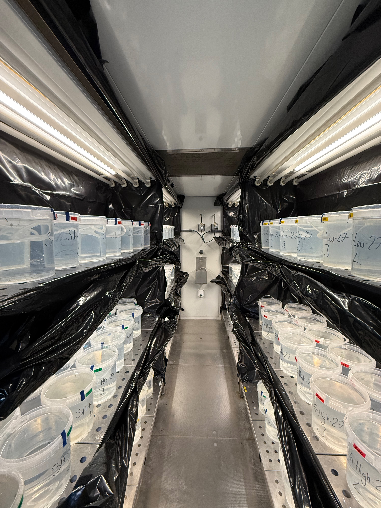

::: {.hero}

# The Neptune Lab

## Ecology | Physiology | Conservation

Understanding how wildlife responds to environmental change.

[Join the Lab](join.qmd){.btn-primary}  

:::

## Research

Research in the Neptune Lab explores how organisms respond to various anthropogenic stressors, with a focus on physiology, behavior, and conservation. We ask questions aimed at understanding how different organisms use physiological, morphological, and behavioral adaptations to cope with climate change, pollution, and other aspects of habitat modification. 

::: {.research-cards}

::: {.research-card}

### Environmental Cues

Understanding how vertebrates use environmental signals, such as photoperiod, to regulate physiology, behavior, and seasonal responses.

[Explore photoperiod →](research.qmd#photoperiod){.btn-primary}

:::

::: {.research-card}

### Artificial Light at Night

Investigating how physiological mechanisms shape responses to environmental stress and influence vulnerability in changing environments.

[Explore light pollution →](research.qmd#alan){.btn-primary}

:::

::: {.research-card}

### Community Ecology

Examining how interacting environmental pressures influence community structure and dynamics via changes to species interactions.

[Explore communities →](research.qmd#community){.btn-primary}

:::

:::

## Latest News

::: {.news}

### Fulbright Research in Spain

During my Fulbright fellowship in Spain, I investigated the potential synergistic effects of light pollution, photoperiod, and temperature on spadefoot toads with some truly incredible collaborators.

[Read more →](news.qmd#fulbright-spain)

:::

## Media Coverage

Check out this cool research on how photoperiod drives overwintering preparation in gray treefrogs, which may ultimately create ecological traps.

<iframe src="https://www.instagram.com/p/DSVGwjrAYqp/embed"
        width="100%"
        height="480"
        frameborder="0"
        scrolling="no"
        allowtransparency="true">
</iframe>

**Featured in:**

[The Wildlife Society](https://wildlife.org/freeze-proof-frogs-think-winter-is-coming-but-is-it/) — Freeze-proof frogs think winter is coming—but is it?

[India Today](https://www.indiatoday.in/environment/story/animals-frogs-climate-change-winter-day-light-day-length-physiological-changes-ecological-trap-warming-planet-2799565-2025-10-08) — Climate change may create an ecological trap for species that rely on seasonal cues.

[Earth.com](https://www.earth.com/news/tree-frogs-freeze-themselves-for-a-winter-that-never-comes/) — Tree frogs freeze themselves for a winter that may never come.

[Phys.org](https://phys.org/visualstories/2025-10-climate-ecological-species.amp) — Climate change may create an ecological trap for species that cannot adapt.

[Mundiario](https://www.mundiario.com/articulo/tecnologia-ciencia/cambio-climatico-podria-empujar-especies-trampa-ecologica/20251008111916358562.html) — Climate change and ecological traps in seasonal species.

## Photos from the Field

<figure class="field-photo-credit">

<figcaption class="image-credit">
Photo credit: Mike Benard
</figcaption>

</figure>

See photos of our research from the field and the amazing species we study!

[Explore Photos →](field-notes.qmd){.btn-primary}

## Interested in Ecology and Conservation?

I would love to hear from students who are curious about nature and excited to learn how research can help us understand and conserve biodiversity.

[Join the Lab](join.qmd){.btn-primary}

---

<video class="field-video" controls>
<source src="images/field-notes/toad-calling.mp4" type="video/mp4">
</video>

Male American toad (*Anaxyrus americanus*) calling during the breeding season.

<video class="field-video" controls>
<source src="images/field-notes/tadpole-eating.mp4" type="video/mp4">
</video>

Spadefoot toad (*Pelobates cultripes*) tadpole eating spinach. Super cute!

