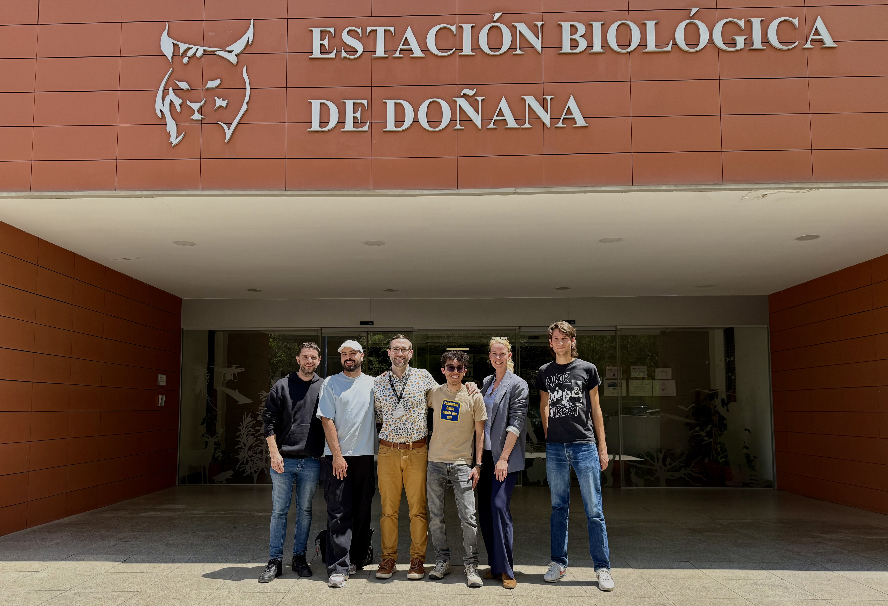
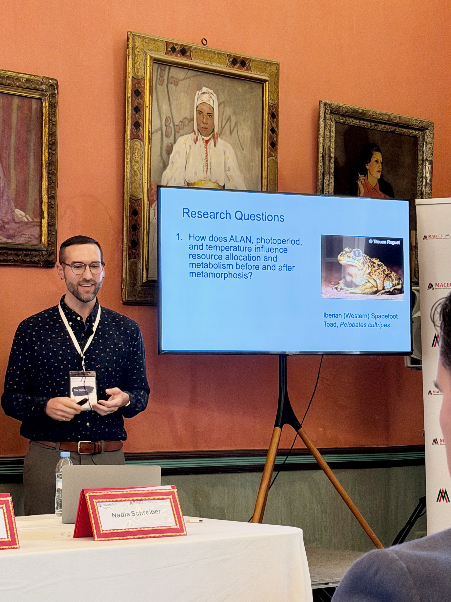
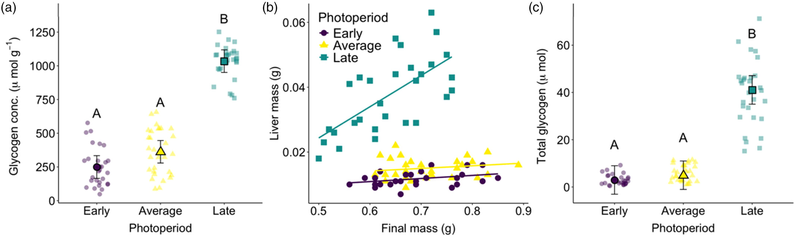
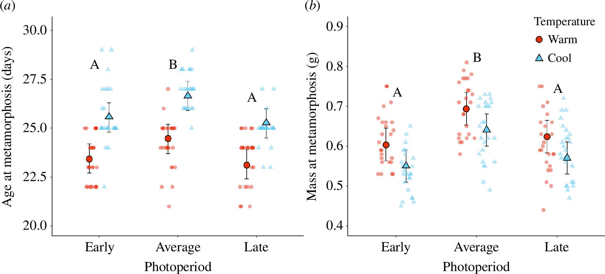
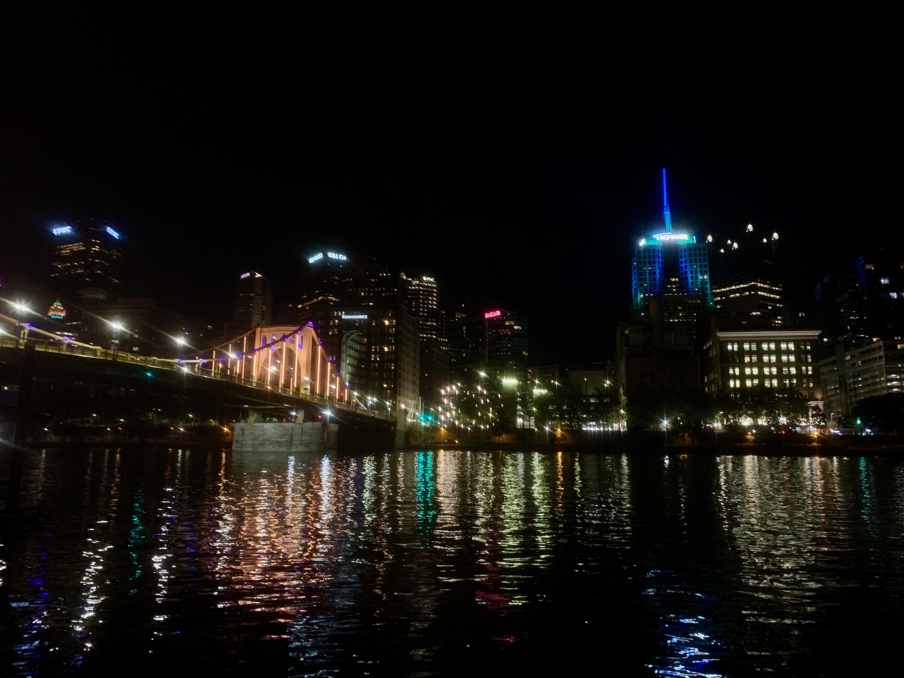

## July 2026

### Started as a Visiting Assistant Professor at Oberlin College

I am officially starting a new position at the beautiful Oberlin College and Conservatory! I am so excited about this new adventure. I will be teaching Organismal Biology, which covers animal and plant anatomy/physiology (and more!). I will also be teaching The Spectrum of Sex, a course about how sex is determined, how complicated that actually is, and how diverse sex determination is across the animal kingdom. It will be a super fun class to teach!

## January 2025 – May 2026

### Investigating Multiple Environmental Stressors Through International Collaboration

During my Fulbright postdoctoral fellowship in Spain, I joined researchers at the Estación Biológica de Doñana (EBD) to investigate how amphibians respond to changing environmental conditions. Working with spadefoot toads (*Pelobates cultripes*), our collaborative project examined how photoperiod, Artificial Light at Night, and temperature interact to influence physiological and developmental responses.

This research was conducted in collaboration with Dr. Katharina Ruthsatz, Dr. Pablo Burraco, and graduate researchers at the EBD (shoutout to Marco, Willian, and Flavio!). Bringing together scientists and students from six countries, this experience provided an incredible opportunity to share ideas, build new collaborations, and better understand amphibian responses to environmental stressors. 

This experience really helped shape the future direction of the Neptune Lab by strengthening our focus on understanding how environmental cues and anthropogenic stressors interact to influence physiological responses to global change.

## April 2026

### Sharing Fulbright Research and Building Connections in Morocco

During my Fulbright in Spain, I had the opportunity to present ongoing research on amphibian responses to Artificial Light at Night (ALAN) at the Fulbright “Crossing the Strait” Conference in Tangier, Morocco.

My oral presentation, *Investigating Responses to Artificial Light at Night in the Iberian Spadefoot Toad*, shared preliminary findings from our research regarding larval-stage responses to ALAN, photoperiod, and temperature. 

Beyond sharing research, the most meaningful part of the conference was connecting with Fulbright scholars from Spain and Morocco. It was so interesting to learn about their work from a wide range of disciplines, including culture, history, language, media, and cybersecurity. These conversations reinforced the importance of international collaboration and the value of approaching global challenges from multiple perspectives.

## October 2025

### When Frogs Make Headlines: Research Featured in International Media

Our research on how amphibians prepare for seasonal changes in photoperiod and temperature was recently featured by [*The Wildlife Society*](https://wildlife.org/freeze-proof-frogs-think-winter-is-coming-but-is-it/), [*Phys.org*](https://phys.org/visualstories/2025-10-climate-ecological-species.amp), [*Earth.com*](https://www.earth.com/news/tree-frogs-freeze-themselves-for-a-winter-that-never-comes/), and [*India Today*](https://www.indiatoday.in/environment/story/animals-frogs-climate-change-winter-day-light-day-length-physiological-changes-ecological-trap-warming-planet-2799565-2025-10-08).

The study, published in the *Journal of Animal Ecology*, explores how eastern gray treefrogs (*Hyla versicolor*) use photoperiod to anticipate winter conditions. As climate change alters temperature patterns, these reliable seasonal cues may become increasingly mismatched with the environments that organisms experience.

The story reached audiences beyond the scientific community through international media coverage and an [Instagram Reel](https://www.instagram.com/p/DSVGwjrAYqp/) showcasing how frog physiology, seasonal biology, and climate change are connected.

## September 2025

### New Research Published: Photoperiod as an Ecological Trap?

Our new study published in *Journal of Animal Ecology* examines how amphibians use photoperiod to prepare for winter conditions.

Using eastern gray treefrogs (*Hyla versicolor*), we found that photoperiod alone can trigger physiological changes associated with winter survival, including increased cryoprotectant accumulation and altered thermal tolerance. However, as climate change causes winters to warm and seasonal temperature conditions become less predictable, organisms that rely on photoperiod may receive misleading information about upcoming environmental conditions.

These findings highlight the importance of understanding how animals use environmental cues to anticipate seasonal change and how global change can disrupt these critical biological signals.

Read the paper:  
[Freeze-tolerant frogs accumulate cryoprotectants using photoperiod: A potential ecological trap →](https://besjournals.onlinelibrary.wiley.com/doi/10.1111/1365-2656.70125)

## May 2025

### Awarded Fulbright Fellowship to Conduct Research in Spain

I was selected for a Fulbright fellowship to conduct research at the Estación Biológica de Doñana (EBD) in Seville, Spain, with Drs. Katharina Ruthsatz and Pablo Burraco. The focus of the project is on understanding how amphibians respond to ecologically relevant levels of light pollution and how long effects of light pollution persist after metamorphosis. 

What an incredible opportunity!

## July 2024

### New Research Published: How Does Photoperiod Shape Amphibian Development?

Our new study, published in *Proceedings of the Royal Society B*, examines how photoperiod and temperature interact to influence development and patterns of growth in gray treefrogs (*Hyla versicolor*).

By experimentally manipulating seasonal light and temperature conditions during larval development, we found that photoperiod can have lasting effects on metamorphosis and juvenile growth. This is the first study that shows the comprehensive and lasting effects of photoperiod as an enviornmental signal. 

Read the paper:  
[Longer days, larger grays: carryover effects of photoperiod and temperature in gray treefrogs →](https://royalsocietypublishing.org/rspb/article/291/2026/20241336/104506/Longer-days-larger-grays-carryover-effects-of)

## July 2024

### Research Recognized at the Joint Meeting of Ichthyologists and Herpetologists

I was honored to receive the [**Stoye Presentation Award**](https://www.asih.org/awards/stoye-award) in Ecology and Ethology from the American Society of Ichthyologists and Herpetologists (ASIH) for my oral presentation at the Joint Meeting of Ichthyologists and Herpetologists (JMIH) in Pittsburgh, Pennsylvania.

My presentation, *Tradeoffs between growth and overwintering preparation in response to photoperiod in gray treefrogs: a potential ecological trap*, highlighted my research examining how amphibians respond to natural variation in photoperiod.

This recognition provided an exciting opportunity to share my work with the broader herpetological community and connect with researchers studying amphibians and reptiles from around the world. I cannot wait to go back!