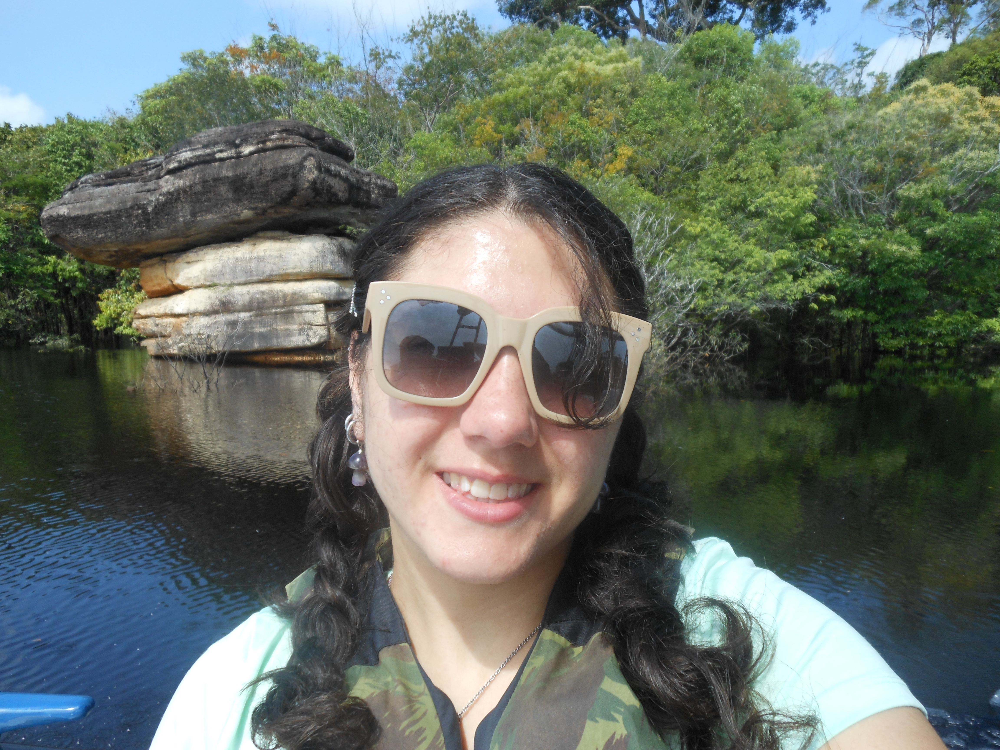

<figure class="profile-photo-container">

<figcaption class="image-credit">
Photo credit: Mike Benard
</figcaption>

</figure>

# Troy Neptune, PhD

Primary Investigator 
*Visiting Assistant Professor* 
Oberlin College & Conservatory 
he/they

[Current CV](files/Troy_Neptune_CV.pdf)

I have always been curious about the natural world and the ways animals interact with their environments. As an ecologist, I enjoy exploring questions that reveal how organisms respond to environmental challenges and how we can use that knowledge to better understand and conserve biodiversity. When I am not researching or teaching, I enjoy gardening with my husband and hanging out with my adorable cats, Dorian and Penny. I am also an artist! Check out my work on my [artist Instagram](https://www.instagram.com/troyneptuneart/).

I hope to build a lab environment where students feel encouraged to ask questions, be creative, and develop their own passion for science.

<figure class="profile-photo-container">

<figcaption class="image-credit">
Photo credit: Micaela Tahta Dadourian
</figcaption>

</figure>

# Micaela Tahta Dadourian

Undergraduate Researcher 
BA in Biology, expected spring 2027 
Oberlin College & Conservatory 
Any pronouns

I became a biology major, primarily interested in ecology, because it's a field that is constantly searching to understand every living being on this planet and how interactions among organisms sustain all lives, ecosystems, and the Earth as a whole. This field of study becomes even more enticing when I am able to delve into the lives of creatures that reside in habitats completely different from mine. When I am not in the lab, you can find me crocheting, kickboxing, or trying new vegetarian recipes. I am excited to continue learning about amphibians, crypsis, and the effects of light pollution on aquatic environments.

## Recent iNaturalist Observations

One of my favorite things to do when I am outside is adding observations to iNaturalist. Here are a few of my most recent finds.

<!-- iNaturalist Widget -->

---
