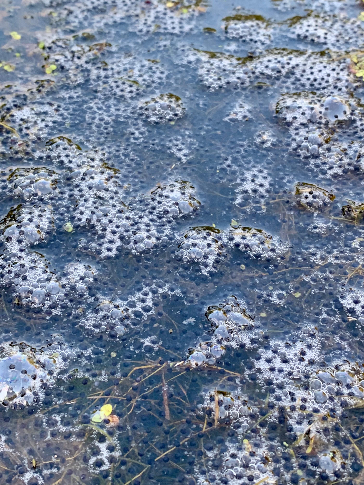

## Manuscripts in Progress

**Neptune, T.C.**, Burraco, P., Petrović, T.G., Gavrić-Čampar, J.P., Gavrilović, B.R., Despotović, S. G., Radovanović, T. B., Radmilović, A., Mirč, M., Kolarov, N. T., and Prokić, M. D. *In review* at *Journal of Experimental Biology*. Artificial light at night disrupts diel antioxidant regulation and activity in European treefrog larvae.

**Neptune, T.C.**, Solis-Sotelo, M.E., Basilico, F., de Paula, W., Burraco, P., and Ruthsatz, K. *In prep.* Ecologically relevant exposure to artificial light at night has lasting effects on a European toad.

**Neptune, T.C.**, Rollins, H.B., and Benard, M.F. *In revision.* Carryover effects of temperature on growth rates across ontogeny in wood frogs (*Rana sylvatica*).

**Neptune, T.C.** *In review* at *Herpetological Review*. *Kinosternon scorpioides scorpioides* (Scorpion Mud Turtle). Predation by Spider.

## Peer-reviewed Publications

**Neptune, T. C.**, Koester, D. C., and Benard, M. F. (2025). [Freeze‐tolerant frogs accumulate cryoprotectants using photoperiod: A potential ecological trap](https://doi.org/10.1111/1365-2656.70125). *Journal of Animal Ecology*, 94, 2255–2266.

**Neptune, T. C.**, Benard, M. F. (2024). [Longer days, larger grays: carryover effects of photoperiod and temperature in gray treefrogs (*Hyla versicolor*)](https://doi.org/10.1098/rspb.2024.1336). *Proceedings of the Royal Society B: Biological Sciences*, 291, 2026.

**Neptune, T. C.**, Benard, M. F. (2023). [Photoperiod effects in a freshwater community: Amphibian larvae develop faster and zooplankton abundance increases under an early‐season photoperiod](https://doi.org/10.1002/ece3.10400). *Ecology and Evolution*, 13, e10400.

**Neptune, T. C.**, Bouchard, S. S. (2020). [Predation and competition induce variable organ size trade-offs in larval anurans](https://doi.org/10.1111/jzo.12824). *Journal of Zoology*, 312, 193–204.

## Research Profiles

[ResearchGate](https://www.researchgate.net/profile/Troy-Neptune)

[ORCID](https://orcid.org/0000-0003-3092-8101)

