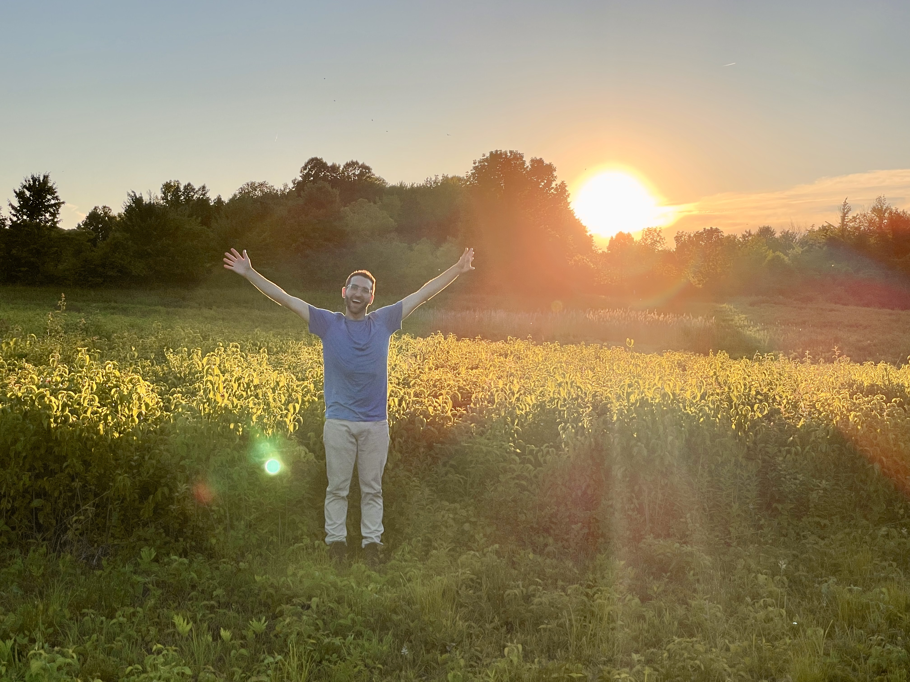
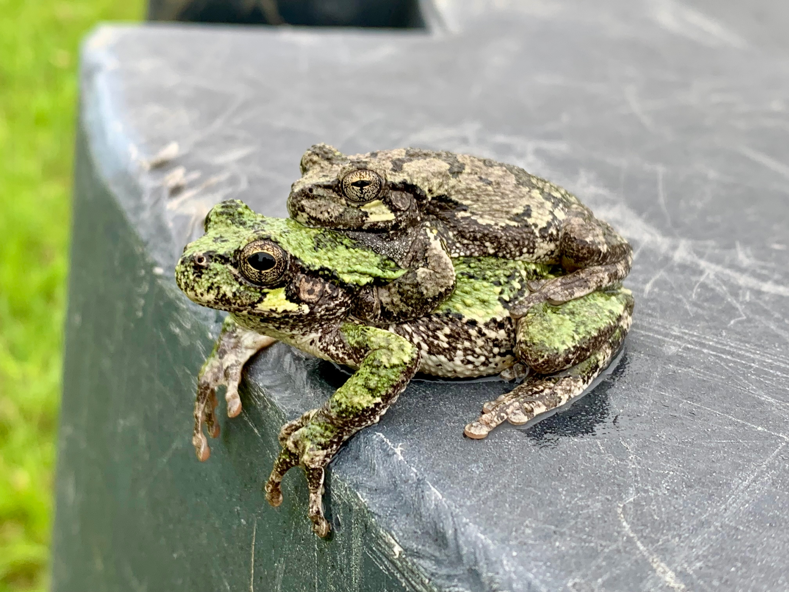
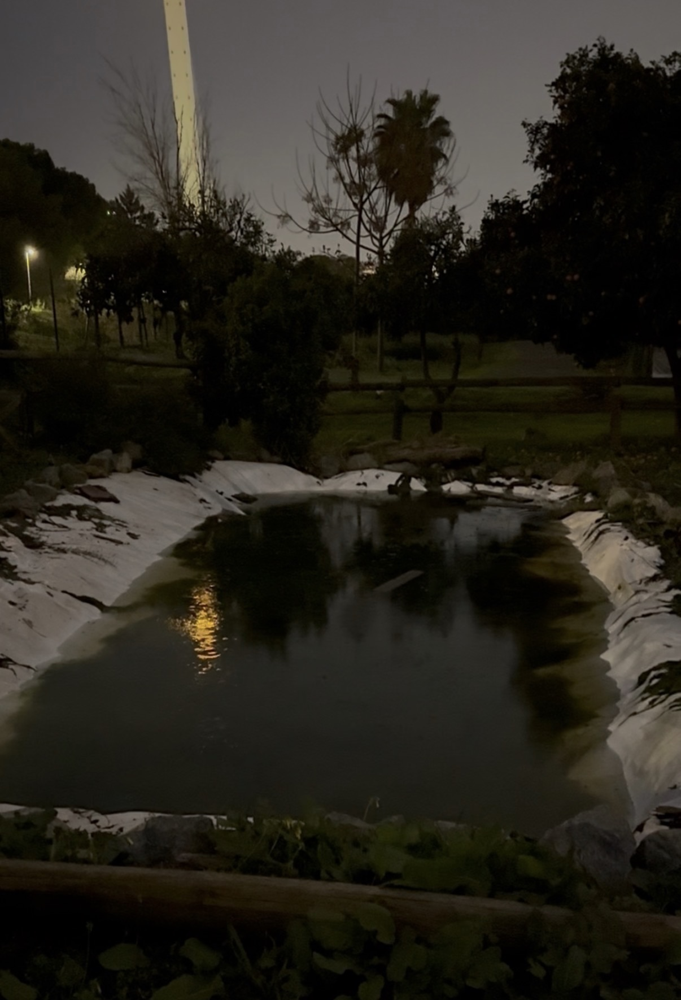
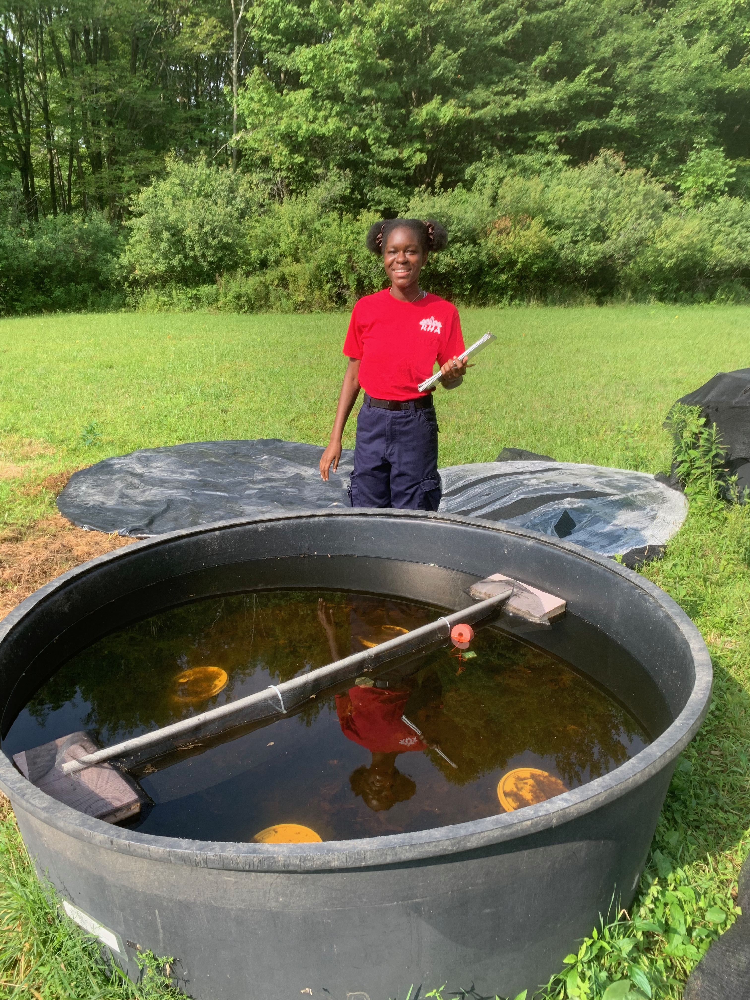

::: {.research-intro}

::: {.research-text}

The research we do in the Neptune Lab investigates how organisms perceive and cope with environmental change. Through a physiological, morphological, and behavioral framework, our research examines how environmental cues regulate seasonal adaptations and how anthropogenic stressors disrupt those cues.

As organisms are faced with multiple interacting stressors, this mechanistic approach allows us to better understand why some organisms persist in rapidly changing ecosystems while others do not.

Our research focuses primarily on amphibians and other ectotherms, using laboratory experiments, field-based approaches, and ecological manipulations to understand how organisms respond to changing environments.

:::

::: {.research-image}

<figure class="research-photo">

<figcaption>
Gray treefrog (*Hyla versicolor*) adult on leaf. 
</figcaption>

</figure>

:::

:::

## Research Questions

The Neptune Lab investigates three interconnected questions:

1. How do amphibians and other ectotherms use environmental cues like photoperiod to regulate seasonal changes in physiology, morphology, and behavior?

2. How does global change and anthropogenic stressors alter organisms’ ability to correctly perceive seasonal environmental changes?

3. How do altered physiological and behavioral responses scale to influence species interactions and community dynamics?

::: {.join-columns .columns}

::: {.column width="45%" .image-left}

<figure class="research-photo">

<figcaption class="image-credit">Image credit: Tim Neptune</figcaption>

<figcaption>
Photoperiod is an important cue for many organisms.
</figcaption>

</figure>

<figure class="research-photo">

<figcaption>
Gray treefrog (*Hyla versicolor*) mating pair.
</figcaption>

</figure>

:::

::: {.column width="55%"}

## Environmental cues and ecological timing

Light is an important cue for many organisms, and variation in light can drive behavioral and physiological changes across various taxa.

At nonequatorial latitudes, the duration of daylight (i.e. photoperiod) consistently changes with the seasons and corresponds to variation in the thermal environment. While we know relatively more about how certain taxa respond to photoperiod, such as birds using photoperiod to time migration, we know comparatively very little about how amphibians use photoperiod to time seasonal physiological and behavioral responses.

Our research investigates how amphibians use photoperiod to regulate seasonal adaptations, including growth, metamorphic timing, and physiological preparation for overwintering.

:::

:::

::: {.join-columns .columns}

::: {.column width="55%"}

## Disruption to photoperiod perception via light pollution

Human activity modifies or, in some cases, completely eliminates the perception of the dark cycle through the use of artificial light exposure during the nighttime.

Artificial Light at Night (ALAN) affects many species by disrupting their perception of photoperiod, which can influence survival, reproduction, and behavior.

Our research examines how ecologically realistic levels of light pollution alter amphibian physiology and behavior, as well as how these effects may scale to influence ecological interactions.

:::

::: {.column width="45%" .image-right}

<figure class="research-photo">

<figcaption>
Human-made pond exposed to urban light pollution in Seville, Spain. 
</figcaption>

</figure>

:::

:::

::: {.join-columns .columns}

::: {.column width="45%" .image-left}

<figure class="research-photo">

<figcaption>
Outdoor mesocosms are perfect tools to conduct research across different community compositions.
</figcaption>

</figure>

:::

::: {.column width="55%"}

## Community dynamics in response to environmental stressors

Species differ in their sensitivity to environmental stressors, and these differences may therefore alter ecological interactions.

Because physiological and behavioral traits determine how organisms allocate energy, acquire resources, and interact with other species, understanding organismal responses provides a mechanistic framework for predicting community-level consequences.

Research in the lab often uses outdoor artificial ponds (i.e. mesocosms) to investigate how anthropogenic stressors influence amphibians and their interactions with predators, competitors, and other members of freshwater communities.

:::

:::

## Multiple stressors and resilience

Most organisms are not exposed to only one stressor. For example, a tadpole could be simultaneously exposed to light pollution, increased temperatures, and exposure to predators.

Research in the Neptune Lab examines how multiple anthropogenic stressors interact to influence amphibian physiology and behavior. By combining manipulations of photoperiod, ALAN, temperature, and other environmental variables, we aim to identify the mechanisms that may help promote resilience under various global change scenarios.

**What are your ideas? I would love to hear about them!**

[Contact Troy →](contact.qmd){.btn-primary}

